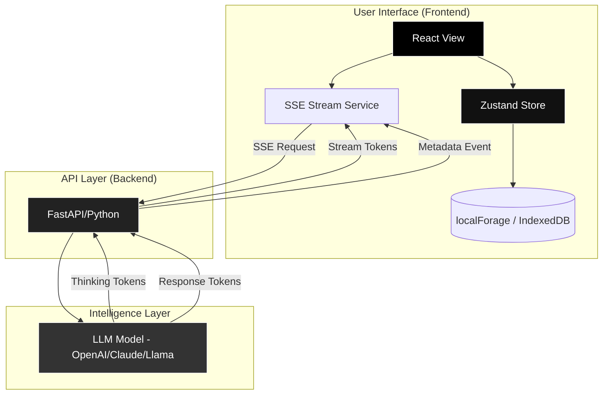

# BotBox 🤖

A high-performance, local-first LLM chat interface featuring real-time streaming, reasoning (thinking) tokens, and precise context window tracking. 


## 📌 Project Overview

**BotBox** is a professional-grade chat UI designed for developers and power users who need deep visibility into the LLM's reasoning process and token consumption. Unlike standard chat interfaces, BotBox treats token tracking as a first-class citizen, accumulating verified usage data directly from the backend to provide a transparent view of the conversation's context window.

### Scope
- **High-Performance Streaming**: Optimized rendering pipeline to handle large LLM outputs without UI lag.
- **Reasoning Visibility**: Dedicated "Thinking" sections to display model reasoning tokens.
- **Local-First Persistence**: Full conversation history and settings stored locally via IndexedDB.
- **Token Intelligence**: Cumulative token tracking and context window management.

---

## 🚀 Getting Started

### Prerequisites
- **Node.js** (v18+ recommended)
- **npm** or **yarn**
- **Backend API** (Python/FastAPI backend providing SSE stream)

### Installation

#### 1. Frontend Setup
```bash
# Navigate to the frontend directory
cd frontend

# Install dependencies
npm install

# Start the development server
npm run dev
```
The app will be available at `http://localhost:5173`.

#### 2. Backend Setup
```bash
# Navigate to the backend directory
cd backend

# Create a virtual environment
uv sync

# Configure environment variables (.env)
# API_KEY=your_key_here
# MODEL_NAME=gpt-4-turbo

# Start the server
uv run fastapi dev
```

---

## 🏗 Project Structure

```text
.
└── 📁botbox
    └── 📁backend
        └── 📁app
            └── 📁api
                └── 📁routes
                    ├── chat.py
                    ├── models.py
                ├── __init__.py
                ├── deps.py
            └── 📁core
                ├── __init__.py
                ├── context.py
                ├── errors.py
                ├── exceptions.py
                ├── llm.py
                ├── security.py
                ├── streaming.py
                ├── tools.py
                ├── trimming.py
            └── 📁schemas
                ├── __init__.py
                ├── chat.py
                ├── common.py
                ├── error.py
                ├── model.py
            └── 📁services
                ├── __init__.py
                ├── agent_factory.py
                ├── chat_service.py
                ├── validation_service.py
            ├── __init__.py
            ├── config.py
            ├── dependencies.py
            ├── main.py
    └── 📁frontend
        └── 📁public
            ├── botbox_logo.png
            ├── logo.jpeg
            ├── logo.png
        └── 📁src
            └── 📁components
                ├── index.js
                ├── Sidebar.jsx
            └── 📁hooks
                ├── index.js
                ├── useLocalForage.js
                ├── useUnsavedChangesWarning.js
            └── 📁layouts
                ├── RootLayout.jsx
            └── 📁lib
                ├── backend.js
                ├── chatPayloadBuilder.js
                ├── encryption.js
                ├── index.js
                ├── localforage.js
                ├── runtimeConfig.js
            └── 📁pages
                ├── ChatPage.jsx
                ├── ModelHubPage.jsx
                ├── SettingsPage.jsx
            └── 📁routes
                ├── index.jsx
            └── 📁services
                ├── api.js
                ├── chatStreamService.js
                ├── index.js
                ├── persistence.js
            └── 📁store
                ├── conversationStore.js
                ├── index.js
                ├── modelStore.js
                ├── schemas.js
                ├── settingsStore.js
                ├── uiStore.js
            └── 📁utils
                ├── constants.js
            ├── App.jsx
            ├── index.css
            ├── main.jsx

```

---

## 📐 Architecture Diagram



---

## ✨ Key Features

### ⚡ High-Performance Rendering
To eliminate "jumping" and lag during large streaming responses, the app utilizes a **Hybrid Rendering Pipeline**:
- **Streaming Phase**: Active messages are rendered as raw text using a throttled UI tick (~12Hz) to prevent DOM thrashing.
- **Finalization Phase**: Once the stream completes, the content is passed through `ReactMarkdown` for rich formatting and syntax highlighting.
- **Memoization**: `MessageItem` and `MarkdownContent` are strictly memoized to isolate re-renders.

### 🧠 Thinking Sections
The app supports models that provide reasoning tokens (Chain-of-Thought).
- **Real-time Expansion**: Reasoning tokens are streamed into a collapsible "Thinking" block that auto-expands during generation.
- **Visual Separation**: Thinking blocks are styled distinctively from the final response to separate "internal monologue" from the "final answer".

### 📊 Verified Token Tracking
BotBox rejects estimated token counts in favor of verified backend data:
- **Cumulative Summing**: The context window counter sums `total_tokens` across all assistant responses in a conversation.
- **Verified Data**: If the backend provides `None` or fails to send metadata, the counter displays `?` instead of an arbitrary estimate.
- **Context Awareness**: Integration with `accumulatedTrimBoundary` ensures the UI reflects exactly what is sent to the model.


---

## 🛠 Technical Details

### Frontend Stack
- **Framework**: React 18 (Functional Components + Hooks)
- **State Management**: Zustand (Atomic state updates)
- **Persistence**: localForage (IndexedDB wrapper for offline-first capability)
- **Styling**: Tailwind CSS
- **Icons**: Lucide-React

### Backend Communication
The app communicates with the backend via **Server-Sent Events (SSE)** to enable real-time streaming.
**Event Schema:**
- `token`: Sends a chunk of content (String or Thinking Array).
- `metadata`: Sends `input_tokens`, `output_tokens`, and `total_tokens` (Snake Case).
- `done`: Signals the end of the response.
- `error`: Sends error details.

### Performance Optimizations
- **Ref-based Accumulation**: Token accumulation happens in `useRef` to bypass the Zustand render cycle for every single token.
- **RequestAnimationFrame**: Auto-scrolling is stabilized using `requestAnimationFrame` to prevent stuttering.
- **Lazy Loading**: Route-based code splitting for `SettingsPage` and `ModelHub`.

---

## ⚙️ Configuration

### Local Settings
Users can configure the following globally:
- **Context Window**: Minimum 2000 tokens.
- **Temperature**: 0.0 (Deterministic) to 2.0 (Creative).
- **System Prompt**: Global instructions injected into every conversation.
- **Default Model**: Pre-selected model for new sessions.
